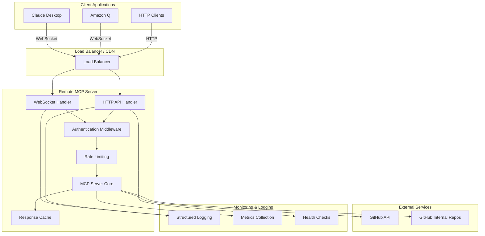
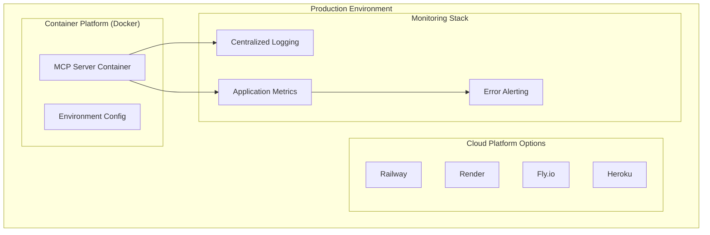

# Design Document

## Overview

This design transforms the existing local MCP server into a remote server accessible via HTTP and WebSocket connections. The solution maintains full backward compatibility while adding remote access capabilities, authentication for internal documentation, and production-ready deployment features.

The architecture leverages the existing MCP SDK but replaces the stdio transport with HTTP/WebSocket transports, adds an Express.js web server layer for HTTP endpoints, and implements proper security, monitoring, and deployment configurations.

## Architecture

### High-Level Architecture



### Transport Layer Design

The server will support multiple transport mechanisms:

1. **WebSocket Transport**: Primary transport for MCP clients (Claude Desktop, Amazon Q)
2. **HTTP REST API**: Alternative access for web applications and direct integration
3. **Backward Compatibility**: Maintain stdio transport for local development

### Deployment Architecture



## Components and Interfaces

### 1. Transport Abstraction Layer

**Purpose**: Provide unified interface for different transport mechanisms

```typescript
interface TransportHandler {
  initialize(): Promise<void>;
  handleRequest(request: MCPRequest): Promise<MCPResponse>;
  close(): Promise<void>;
}

class WebSocketTransport implements TransportHandler {
  // WebSocket-specific implementation
}

class HttpTransport implements TransportHandler {
  // HTTP REST API implementation
}

class StdioTransport implements TransportHandler {
  // Existing stdio implementation (for local dev)
}
```

### 2. Authentication & Authorization Service

**Purpose**: Handle authentication for internal documentation access

```typescript
interface AuthService {
  validateToken(token: string): Promise<AuthResult>;
  hasInternalAccess(authResult: AuthResult): boolean;
  generateApiKey(): string;
}

interface AuthResult {
  isValid: boolean;
  userId?: string;
  permissions: string[];
  rateLimitTier: 'public' | 'authenticated' | 'premium';
}
```

### 3. Rate Limiting Service

**Purpose**: Prevent abuse and ensure fair usage

```typescript
interface RateLimiter {
  checkLimit(clientId: string, tier: string): Promise<RateLimitResult>;
  recordRequest(clientId: string): Promise<void>;
}

interface RateLimitResult {
  allowed: boolean;
  remainingRequests: number;
  resetTime: Date;
}
```

### 4. Enhanced MCP Server Core

**Purpose**: Extended MCP server with remote capabilities

```typescript
class RemoteMCPServer extends McpServer {
  private authService: AuthService;
  private rateLimiter: RateLimiter;
  private cache: ResponseCache;
  private logger: Logger;
  
  async handleAuthenticatedRequest(
    request: MCPRequest, 
    auth: AuthResult
  ): Promise<MCPResponse>;
}
```

### 5. Configuration Management

**Purpose**: Environment-based configuration for different deployment scenarios

```typescript
interface ServerConfig {
  server: {
    port: number;
    host: string;
    cors: CorsConfig;
    ssl: SSLConfig;
  };
  auth: {
    required: boolean;
    apiKeyHeader: string;
    internalTokenRequired: boolean;
  };
  rateLimit: {
    public: RateLimitConfig;
    authenticated: RateLimitConfig;
  };
  github: {
    publicRepo: GitHubRepoConfig;
    internalRepo?: GitHubRepoConfig;
  };
  monitoring: {
    logging: LoggingConfig;
    metrics: MetricsConfig;
    healthCheck: HealthCheckConfig;
  };
}
```

## Data Models

### Request/Response Models

```typescript
// Enhanced MCP Request with authentication context
interface AuthenticatedMCPRequest extends MCPRequest {
  auth?: AuthResult;
  clientInfo: {
    userAgent: string;
    ipAddress: string;
    clientId: string;
  };
}

// Enhanced MCP Response with metadata
interface EnhancedMCPResponse extends MCPResponse {
  metadata: {
    source: 'public' | 'internal' | 'mixed';
    cached: boolean;
    processingTime: number;
    rateLimitInfo: RateLimitResult;
  };
}
```

### Configuration Models

```typescript
interface GitHubRepoConfig {
  owner: string;
  repo: string;
  token?: string;
  branch: string;
  cacheTTL: number;
}

interface RateLimitConfig {
  requestsPerMinute: number;
  requestsPerHour: number;
  burstLimit: number;
}

interface CorsConfig {
  origins: string[];
  methods: string[];
  allowCredentials: boolean;
}
```

## Error Handling

### Error Classification

1. **Client Errors (4xx)**
   - 400: Invalid request format
   - 401: Authentication required/failed
   - 403: Insufficient permissions
   - 404: Component/category not found
   - 429: Rate limit exceeded

2. **Server Errors (5xx)**
   - 500: Internal server error
   - 502: GitHub API unavailable
   - 503: Service temporarily unavailable
   - 504: Request timeout

### Error Response Format

```typescript
interface ErrorResponse {
  error: {
    code: string;
    message: string;
    details?: any;
    timestamp: string;
    requestId: string;
  };
  metadata: {
    rateLimitInfo?: RateLimitResult;
    retryAfter?: number;
  };
}
```

### Graceful Degradation

- **GitHub API Failures**: Return cached content with staleness indicators
- **Internal Repo Unavailable**: Fall back to public documentation only
- **Rate Limit Exceeded**: Provide clear retry guidance
- **Authentication Issues**: Gracefully handle with public-only access

## Testing Strategy

### Unit Testing

- **Transport Handlers**: Test WebSocket and HTTP request/response handling
- **Authentication Service**: Test token validation and permission checking
- **Rate Limiting**: Test limit enforcement and reset behavior
- **MCP Server Core**: Test tool execution with authentication context

### Integration Testing

- **End-to-End Flows**: Test complete request flows from client to GitHub API
- **Authentication Integration**: Test authenticated vs unauthenticated access
- **Multi-Transport**: Test same functionality across WebSocket and HTTP
- **Error Scenarios**: Test graceful handling of various failure modes

### Load Testing

- **Rate Limiting**: Verify rate limits work under load
- **Concurrent Connections**: Test WebSocket connection limits
- **GitHub API Integration**: Test behavior under GitHub API rate limits
- **Cache Performance**: Verify caching reduces external API calls

### Security Testing

- **Authentication Bypass**: Attempt to access internal docs without auth
- **Input Validation**: Test malformed requests and injection attempts
- **Rate Limit Bypass**: Attempt to circumvent rate limiting
- **CORS Policy**: Verify cross-origin request handling

## Deployment Strategy

### Container Configuration

```dockerfile
FROM node:18-alpine
WORKDIR /app
COPY package*.json ./
RUN npm ci --only=production
COPY build/ ./build/
EXPOSE 3000
CMD ["node", "build/server.js"]
```

### Environment Variables

```bash
# Server Configuration
PORT=3000
HOST=0.0.0.0
NODE_ENV=production

# Authentication
AUTH_REQUIRED=false
INTERNAL_AUTH_REQUIRED=true
API_KEY_HEADER=X-API-Key

# GitHub Configuration
GITHUB_OWNER=pglevy
GITHUB_REPO=design-system-docs
GITHUB_TOKEN=ghp_xxx
GITHUB_INTERNAL_REPO=design-system-docs-internal
GITHUB_INTERNAL_TOKEN=ghp_yyy

# Rate Limiting
PUBLIC_RATE_LIMIT_PER_MINUTE=60
AUTH_RATE_LIMIT_PER_MINUTE=300

# Monitoring
LOG_LEVEL=info
METRICS_ENABLED=true
HEALTH_CHECK_PATH=/health
```

### Platform-Specific Deployment

#### Railway
- Automatic HTTPS
- Environment variable management
- Built-in monitoring
- Easy GitHub integration

#### Render
- Free tier available
- Automatic deployments
- Built-in SSL
- Health check support

#### Fly.io
- Global edge deployment
- Docker-based deployment
- Built-in load balancing
- Regional scaling

### Monitoring and Observability

#### Health Checks
```typescript
interface HealthCheck {
  status: 'healthy' | 'degraded' | 'unhealthy';
  timestamp: string;
  services: {
    github: ServiceStatus;
    cache: ServiceStatus;
    database?: ServiceStatus;
  };
  metrics: {
    uptime: number;
    requestCount: number;
    errorRate: number;
    averageResponseTime: number;
  };
}
```

#### Structured Logging
- Request/response logging with correlation IDs
- Error logging with stack traces and context
- Performance metrics logging
- Security event logging (auth failures, rate limit hits)

#### Metrics Collection
- Request count and response times
- Error rates by type
- Rate limit hit rates
- GitHub API usage and limits
- WebSocket connection counts